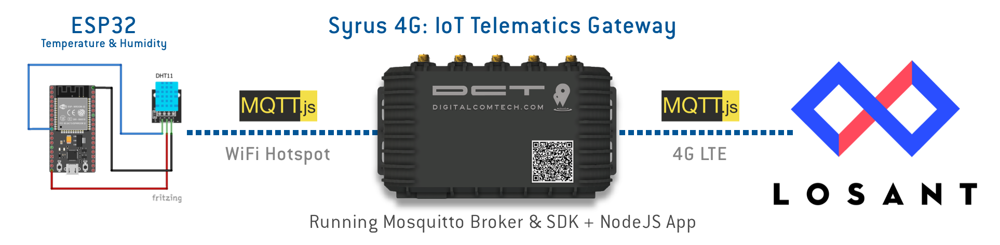
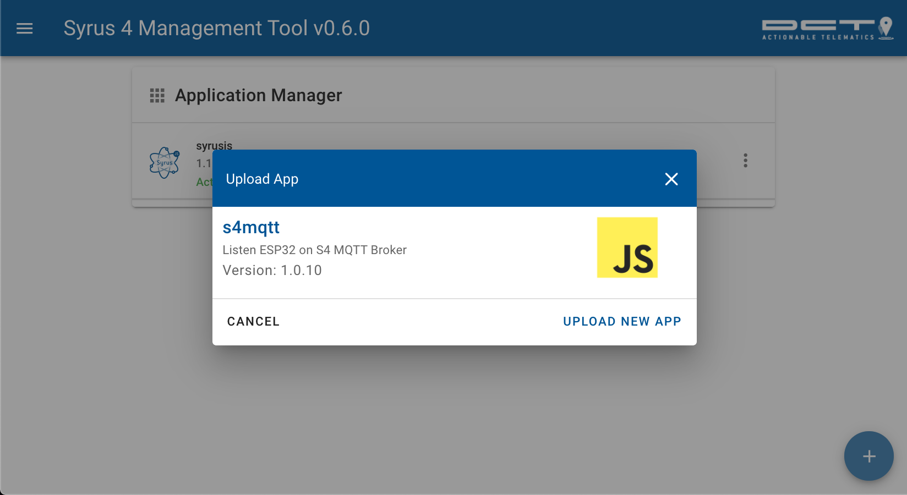
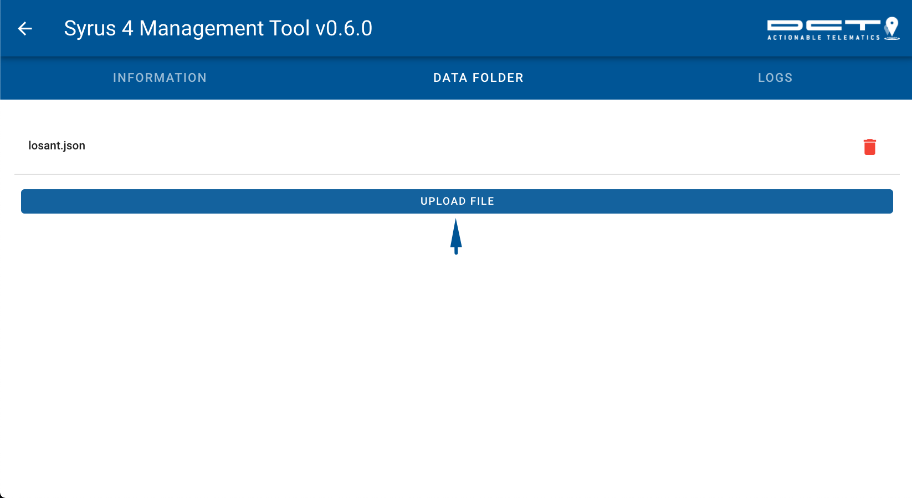
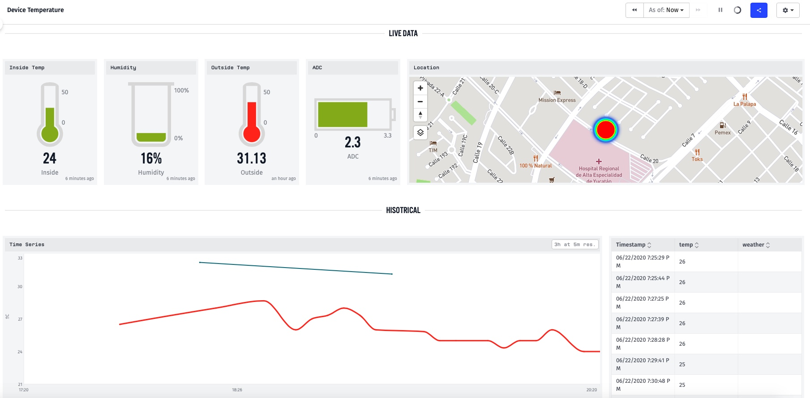

# MQTT Syrus 4 Application v1.0.10



This application reads temperature & humidity data from an ESP32 device and transmits it locally to a Syrus running a Mosquito MQTT broker.
The application makes use of the [Syrus 4 SDK](https://github.com/dctdevelop/syrus4-nodejs) to retrieve location information and transmit it to an external dashboard powered by [Losant](https://www.losant.com/) using MQTT over 4G LTE.


The local wifi connection and remote 4G LTE communication can be configured from the Syrus 4 [Management Tool](https://syrus.digitalcomtech.com/syrdocs/syrus4/management-tool/). 

Download ZIP and install on the Syrus 4 App manager



The application requires you upload a file called **losant.json** on the application directory folder which contains the client, username and password used to configure the losant mqtts endpoint: 
*mqtts://broker.losant.com*

**losant.json**
```json
{
    "client": "CLIENT",
    "username": "USER",
    "password": "PASS"
}
```

To upload the file you'll need to go into the App Manager click on the application and go into the DATA FOLDER tab, then click Upload file and select the **losant.json**



Inside the program there's some topics that you can customize

```js
var subTopic = 'dev/messagestx';
var pubTopic = 'dev/messagesrx';
var remotePubTopic='losant/XXXXXXXXXXXXXXXXXXXXXXXX/state';
```

