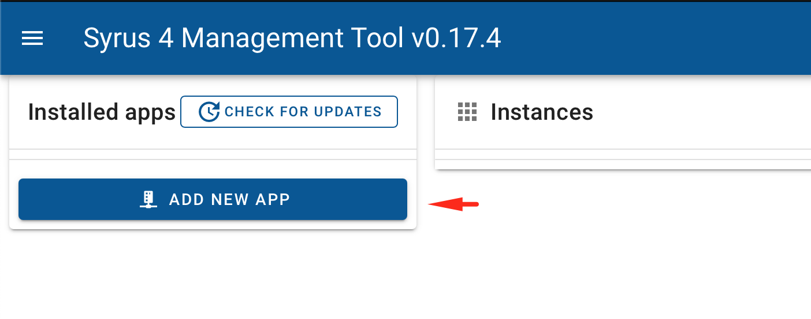
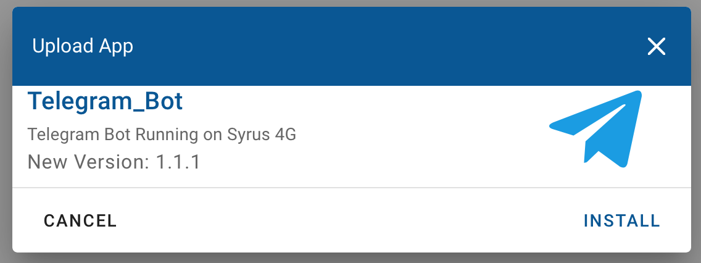
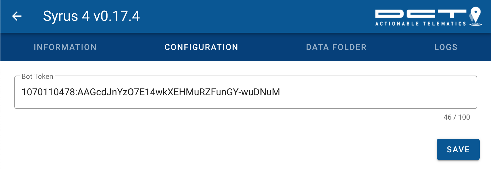
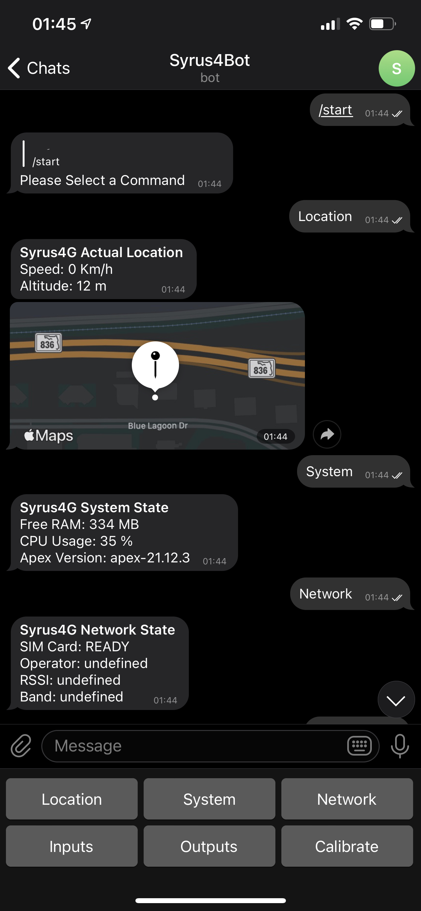

# Telegram Bot Application v1.0.10

Telegram Bot application running on Syrus 4 device.

To get started download or clone this repository and navigate to the Telegram_Bot folder. 

Inside this folder there's a version that's zipped and ready to [install](https://syrus.digitalcomtech.com/syrdocs/syrus4/manage/syrus4-ui.html#application-manager) on your Syrus 4.

If you develop over this repo you'll want to make sure to run the `npm install` command before compressing and installing it later on.

From the [Syrus 4 Application Manager](http://syrusrouter/#/apps-manager) install the Zipped file from this directory.

Next, download and install [Telegram Application](https://telegram.org/) on your phone or desktop and create an account.

Once your account is created add a new user called **@BotFather**

Talk to the @BotFather and give him the following commands

* `/newbot`

<< enter the name of the Bot (example: `Syrus4 Telegram Bot`)

<< enter the username of the Bot (example: `syrus4test_bot`)

Once you're done, the @BotFather will grant a unique token for you.

You can enter this token in the UI under 

Once you click SAVE go back to the **INFORMATION** tab and click on **START** at the bottom.

Now go back to telegram and search for the Bot Name you just created (Syrus4Bot in our screenshot)

Add the bot on telegram and you're ready to interact remotely with your Syrus via Telegram.

