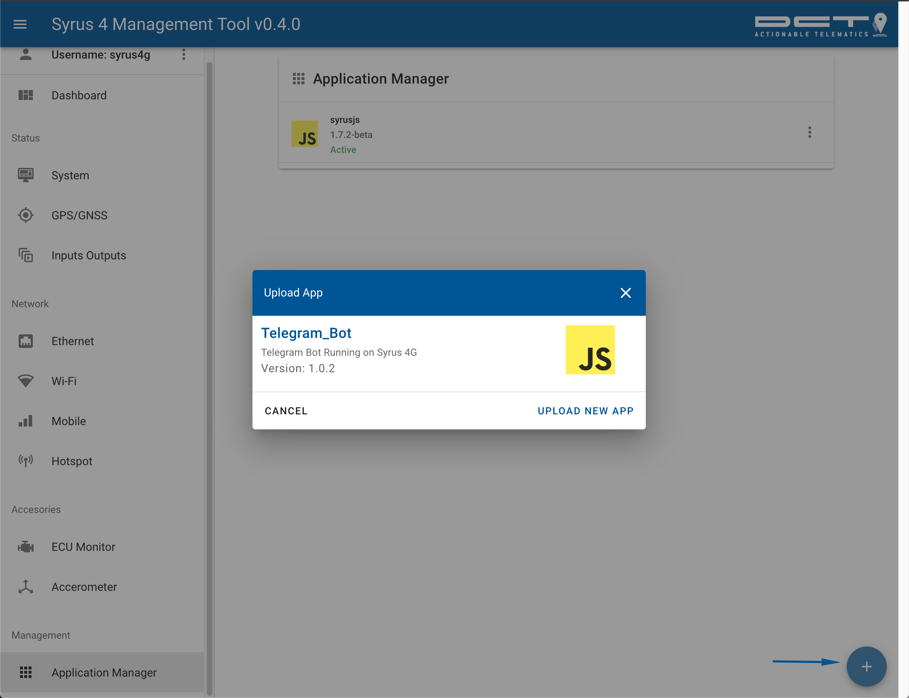
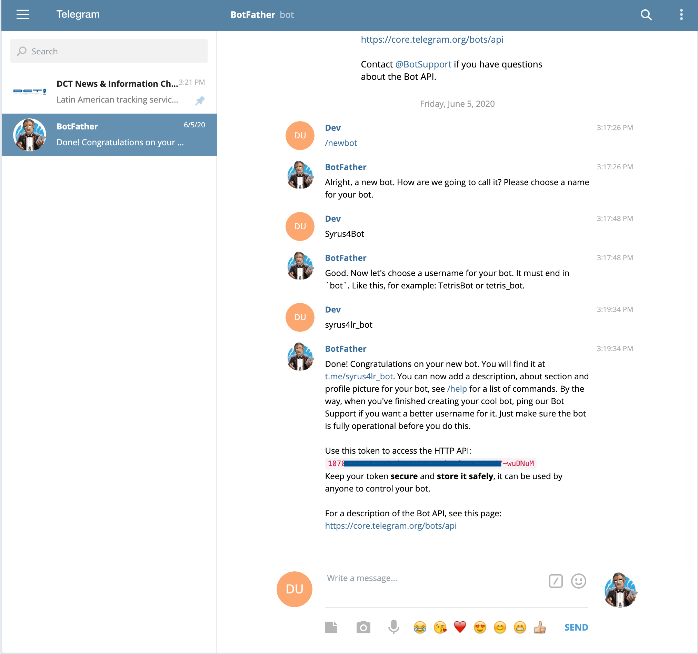
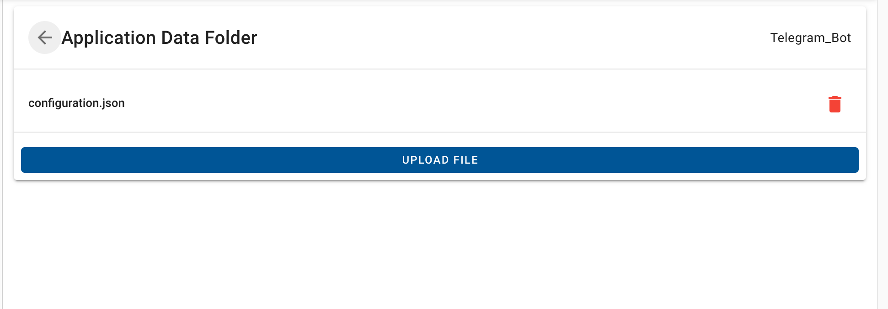
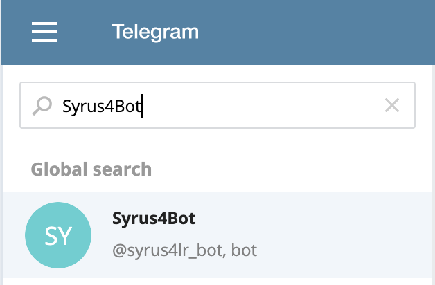
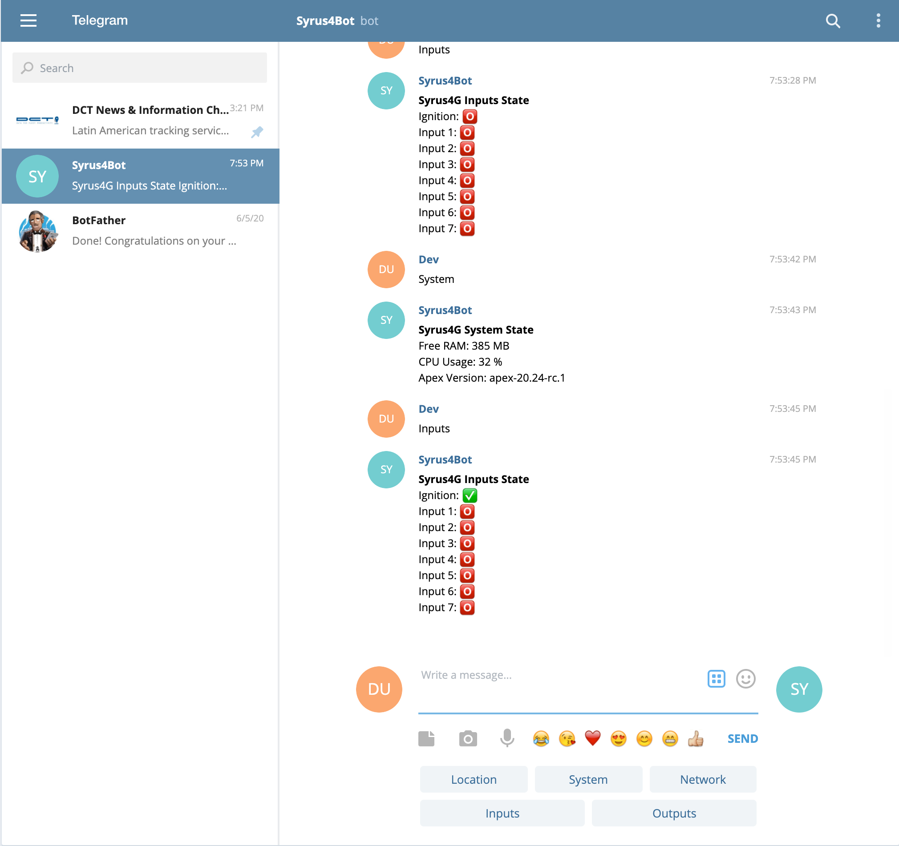

# Telegram Bot Application v1.0.2

Telegram Bot application running on Syrus 4 device.

To get started go to the Syrus 4 Application Manager and install the Zipped file.



Next, download and install Telegram Application on your phone or desktop and create an account. 

Once your account is created add a new user called **@BotFather**

Talk to the @BotFather and give him the following commands

* `/newbot`

<< enter the name of the Bot (example: Syrus4 Telegram Bot)

<< enter the username of the Bot (example: syrus4test_bot)

Once you're done, the @BotFather will grant a unique for you.



Create a new file on a text editor and enter the token information on that file like this: 

```
{
    "token": "1070110478:AAGcdJnYzO7E14lmPDlMuRZFaNGY-wuDNuM"
}
```

save the file as: `configuration.json`

Inside of the Management Tool click on the menu next to the Telegram Application and click on App Directory. 

Click the button to upload file and select the `configuration.json` file. 



Once it's uploaded go back to the Application Manager and click on the Menu and **Start Application**

Now go back to telegram and search for the Bot Name you just created (Syrus4Bot in our screenshot)



Add the bot on telegram and you're ready to interact remotely with your Syrus via Telegram.

