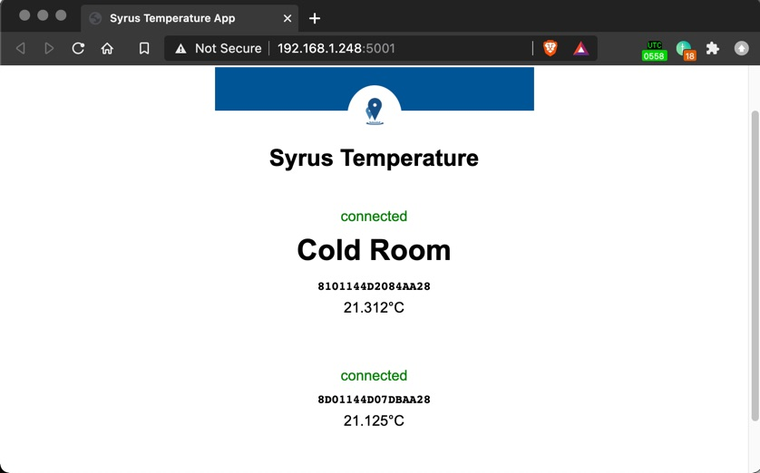

# Syrus Temperature Reader 1.0.11


This application reads temperature data from the onewire module using the NodeJS [SDK](https://github.com/dctdevelop/syrus4-nodejs) and displays multiple temperatures on a local http server, port 5001.

Once you download the Temp_Read.zip you can install it using the [apps-manager](https://syrus.digitalcomtech.com/syrdocs/syrus4/management-tool/#app-manager) UI, or the [apx-apps](https://syrus.digitalcomtech.com/syrdocs/syrus4/tools/#apx-apps) tool. 

After installing, navigate to the `/data/applications/syrustemp` folder inside the Syrus4, and do an `npm install`.

Once installed you can run the application and head over to http://ipAddress:5001 (replace with the device's IP address).

Note, that to get the name of the sensor to appear you'll have to add it with the apx-onewire tool:

```
$ sudo apx-onewire temperature add 'Cold Room' 8101144D2084AA28
```


