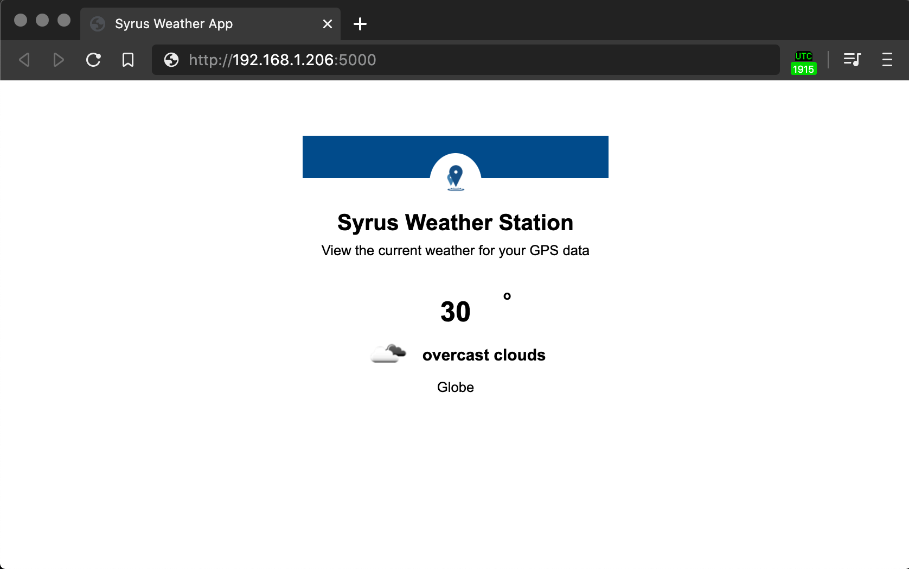

# Syrus Weather Station v1.0.6


This application reads the device's location information using the [SDK](https://github.com/dctdevelop/syrus4-nodejs) and connects to Open Weather Map's weather API to read the temperature at the device's location.

The app requires a file called **configuration.json** uploaded to the application's data directory. 

This file will have an API key from an [OpenWeather account](https://home.openweathermap.org/api_keys).

```json
{
    "appid": "APP_ID_CODE"
}
```

Once you run the application you can visit the device's IP address port 5000 to view the results.


